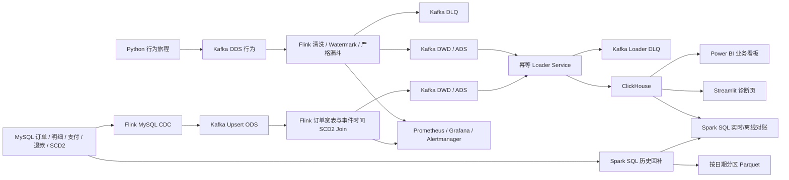

# 电商用户行为实时数仓 · Kafka + Flink CDC + ClickHouse + Spark SQL

> 一个可在个人电脑完整复现的电商**批流一体**实时数仓，覆盖「业务库 CDC + 行为日志 → ODS → DWD → ADS → BI 展示」全链路。

本项目不止把组件“启动起来”，而是验证了实时数仓的关键机制：数据库变更捕获、订单状态流转、商品历史维度（SCD2）、事件时间窗口计算、幂等落库、坏数据隔离（DLQ）、数据质量验收、监控告警、故障恢复，以及实时与离线对账。

**技术栈**：Kafka · Flink SQL · Flink CDC · Spark SQL · ClickHouse · MySQL · RocksDB · Parquet · Prometheus · Grafana · Docker Compose · Python · Power BI

**核心亮点**
- 两条链路覆盖 Append 与 Changelog 两类语义：行为日志（事件时间 / Watermark / 严格漏斗）+ 订单 CDC（Upsert Kafka + 撤回流）。
- 商品 SCD2 历史维度，订单按下单时间命中历史价格（左闭右开区间 `[effective_from, effective_to)`）。
- 常驻 Loader 以「确定性版本 + 显式 Kafka offset」幂等写 ClickHouse；坏消息经 DLQ broker 确认后才推进 offset。
- 24 项数据质量规则 + 端到端业务时间新鲜度监控 + Prometheus / Grafana 告警。
- Spark SQL 从 MySQL 事务事实按日期重算订单日指标，与实时 ADS 全外连接对账。

> ⚠️ 项目定位：企业设计思路的**单机 Docker 实验环境**，用于验证机制与边界，**不宣称生产高可用集群**。

## 两条业务链路



### 用户行为链路

- 生成同一 `session_id` 下可追踪的 view → cart → order → pay 旅程。
- Flink 使用事件时间、5 秒 Watermark、业务 DLQ 和 MySQL JDBC Temporal Lookup Join。
- 输出 1 分钟经营概览、5 分钟商品/品类聚合和 30 分钟严格渠道漏斗。

### 订单 CDC 链路

- MySQL 保存 `order_info`、`order_detail`、`payment_info`、`refund_info` 和 `dim_product_scd2`。
- Flink CDC 读取初始快照和 ROW binlog，写入 5 个 Upsert Kafka ODS Topic。
- DWD 以订单明细为粒度关联订单状态、支付、退款和商品历史版本。
- 商品调价关闭旧版本并新增当前版本，DWD 按订单发生时间命中 `[effective_from, effective_to)`。
- ADS 输出渠道订单生命周期和每日渠道指标，处理 CREATED → PAID/CANCELLED → REFUNDED 的变更流。
- 生成器按创建、支付/取消、退款三个阶段分别提交事务，让 CDC 能观察完整状态迁移。

## 为什么使用这些组件

| 组件 | 项目职责 | 选择原因 |
| --- | --- | --- |
| MySQL | 交易库、主数据、SCD2 | 适合事务更新、主键约束和 binlog CDC |
| Kafka | ODS/DWD/ADS 消息层 | 解耦、削峰、可重放；Upsert Topic 表达更新与删除 |
| Flink SQL / CDC | 清洗、Join、窗口、状态更新 | 支持事件时间、有状态流计算和数据库增量捕获 |
| Spark SQL | 历史日期回补、离线日汇总、实时/离线对账 | 与 Flink 分工：流式增量计算之外提供可重复的批量重算能力 |
| RocksDB + Checkpoint | 算子状态与恢复 | 大状态不完全占用 JVM 堆，故障后从一致状态恢复 |
| ClickHouse | DWD/ADS 查询服务层 | 列式存储适合明细抽查和聚合分析 |
| Python Loader | Kafka 到 ClickHouse 常驻装载、坏消息隔离与批量回放 | 展示批量、重试、显式 offset、DLQ 与逻辑幂等边界 |
| Power BI | 企业业务报表 | 比开发型 Web 页面更贴近常见 BI 交付 |
| Streamlit | 开发诊断页 | 快速查看明细、告警和中间结果，不作为核心交付 |
| Prometheus / Grafana / Alertmanager | 指标、看板、告警路由 | 观察 Job、Checkpoint、Lag、Loader、DLQ 与端到端业务数据年龄 |
| Freshness Exporter | ClickHouse 业务时间探针 | 用代表性 DWD/ADS 最大业务时间衡量链路新鲜度，并显式区分监控与告警策略 |
| Docker Compose | 本地复现 | 固化版本、网络、健康检查、数据卷和启动顺序 |

详细取舍见 [组件选型说明](realtime_dw_project/docs/component_decisions.md)。

## 数据分层与粒度

| 层级 | 落地 | 代表粒度 |
| --- | --- | --- |
| ODS | Kafka | 一次行为事件，或一张 MySQL 业务表的一条最新键值记录 |
| DWD | Kafka + ClickHouse | 一次行为事件；一条订单明细及其订单/支付/退款/历史商品快照 |
| DWS | Flink SQL 逻辑层 | 窗口或订单级中间聚合，不单独持久化 |
| ADS | Kafka + ClickHouse | 时间窗口、渠道、日期等看板查询粒度 |
| 离线 ADS | Parquet（按 `order_date` 分区） | Spark SQL 历史重算结果与对账明细 |

准确说法是“ODS、DWD、ADS 持久化，DWS 作为逻辑聚合层”，不是完整四层物理数仓。

## 可靠性与数据可信度

- Flink Kafka Sink 使用 Exactly-Once，依赖 10 秒 Checkpoint。
- RocksDB 状态后端、固定延迟重启和持久化 Checkpoint 支持 TaskManager 恢复。
- 常驻 Loader 先批量写 ClickHouse，成功后同步提交 Kafka offset；异常退出由 Compose 重启。
- Loader 对 JSON、ClickHouse 映射类型/格式和必填字段异常使用确定性消息 ID 写入 `clickhouse_loader_dlq`；只有获得 broker ACK 后该源 offset 才可提交，DLQ 失败时不会越过坏消息。DLQ 使用纯 `compact`，以消息 ID 为 key 长期保留每条异常的最新 `pending/replayed` 状态，不设置会让未处理记录按时间静默过期的 delete retention。
- `ingest_version` 由 Loader epoch + Kafka partition/offset 确定性生成，历史重放不会凭装载时间覆盖更新值。
- ClickHouse 记录 topic/partition/offset 和版本，`ReplacingMergeTree` + `FINAL` 实现业务键逻辑幂等。
- 质量报告验证行为主键、漏斗单调、支付/退款一致性、SCD2 当前版本和区间、历史价格命中及 ADS 口径。
- `contracts/cdc_contracts.json` 固化五张 CDC 表的字段、主键、Topic、tombstone 与最终一致性语义，CI 自动比对 MySQL/Flink DDL。
- Schema Evolution 演练采用“先加可空字段、契约登记、下游计划升级”，不让上游 DDL 未经评审自动冲击 BI。
- 独立 Freshness Exporter 从行为 DWD、订单 DWD 和实时 ADS 查询最大业务时间并暴露数据年龄；陈旧告警默认关闭，只在已约定持续流量/SLA 的环境显式启用。
- push/PR 运行快速静态与单元测试；手动触发的集成 CI 才启动完整数据面，验证 9 条 Flink 作业、9 个查询输出、tombstone 恢复和 24 项质量规则，并上传验收证据。

边界：Kafka → Flink → Kafka 可使用 Exactly-Once；Kafka → Python Loader → ClickHouse 是可重放的最终一致与逻辑幂等，不是跨系统分布式事务。

## 快速运行

要求：Docker Desktop、Python 3、PowerShell。建议主机至少 8 GB 内存。

Windows：

```powershell
.\start_demo.ps1
```

脚本会执行 `docker compose down -v`，仅适用于本地演示环境。它会重建环境、初始化表和 Topic、提交 9 条 Flink 作业、生成行为与交易数据、演练兼容字段变更、装载 ClickHouse 并验收。

常用入口：

| 服务 | 地址 |
| --- | --- |
| Flink Web UI | http://localhost:8081 |
| Prometheus | http://localhost:9090 |
| Alertmanager | http://localhost:9093 |
| Grafana | http://localhost:3000（本地默认 admin/admin） |
| Loader Metrics | http://localhost:9410/metrics |
| Freshness Metrics | http://localhost:9420/metrics |

保留数据卷停止容器：`.\stop_demo.ps1`；同时关闭 Docker Desktop：`.\stop_demo.ps1 -ShutdownDockerDesktop`。

## 验收、故障与压测

```powershell
cd realtime_dw_project
.\scripts\verify_result.ps1
python scripts\quality_report.py --output artifacts\latest_quality_report.md
.\scripts\schema_evolution_drill.ps1
python scripts\delete_tombstone_drill.py
$env:JOURNEYS='10000'; .\scripts\fault_recovery_drill.ps1
.\scripts\benchmark_pipeline.ps1 -Journeys 10000 -Orders 1000
.\scripts\run_spark_backfill.ps1 -StartDate 2026-08-11 -EndDate 2026-08-12
```

故障脚本会杀掉并重新拉起 TaskManager，要求出现新的 Checkpoint 恢复证据，再执行 Kafka 重放和业务键验收。压测报告只记录增量 Kafka offset 与本机实测，不使用累计行数伪造吞吐。

## 当前规模

- 12 个长期运行容器，另有 1 个一次性 Flink 卷初始化服务和 1 个按需 Spark 批处理容器。
- 15 个业务 Kafka Topic，另有 1 个纯 `compact` Loader DLQ Topic；业务 Topic 默认 3 分区。DLQ 不按时间删除最新状态，但仍需监控磁盘容量并按审计制度归档。
- 9 条 Flink 作业：6 条行为链路、1 条多表 CDC、1 条订单 DWD、1 条双 ADS StatementSet。
- 5 张 MySQL CDC 业务/历史表，另有静态商品、店铺、地区维表和 Schema 契约表。
- 10 张 ClickHouse 查询表。
- 24 项质量报告验收规则和 21 项命令行快速验收规则。

## 文档导航

- [架构与故障边界](realtime_dw_project/docs/architecture.md)
- [数据模型与指标口径](realtime_dw_project/docs/data_model.md)
- [组件选型](realtime_dw_project/docs/component_decisions.md)
- [Schema Evolution](realtime_dw_project/docs/schema_evolution.md)
- [运行手册](realtime_dw_project/docs/operations_runbook.md)
- [性能与故障恢复实测](realtime_dw_project/docs/performance_report.md)
- [Spark SQL 离线回补与实时对账](realtime_dw_project/docs/spark_backfill.md)
- [面试问答](realtime_dw_project/docs/interview_qa.md)
- [面试项目讲解脚本](realtime_dw_project/docs/interview_demo_script.md)
- [简历描述](realtime_dw_project/docs/resume.md)

## 仍然存在的生产化差距

- 单 Kafka Broker、单 JobManager、单 TaskManager，不具备跨节点高可用。
- Checkpoint 在本地卷，不是远端对象存储；没有 Kubernetes 自动调度和弹性扩缩容。
- 没有 Schema Registry、元数据/血缘平台、数据权限和敏感字段治理。
- Python Loader 适合演示可靠性边界；更大规模应评估成熟 ClickHouse Connector。
- Freshness 告警只有在业务确实应持续产数时才有意义；正常静默期与上游断流无法只靠数据年龄自动区分。

企业级不等于组件越多，而是粒度、状态、失败边界、恢复方式、监控和验收都能说清楚。
