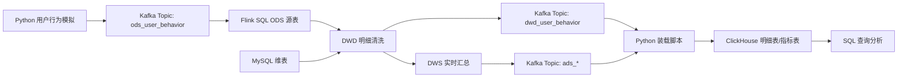

# 电商用户行为实时数仓项目报告

## 一、项目背景

随着电商业务的发展，平台每天会产生大量用户行为数据，例如页面浏览、商品点击、加入购物车、下单、支付等。传统离线数仓通常以天为单位统计指标，适合历史分析和周期性报表，但无法及时反映业务实时变化。

在实际业务中，运营人员往往需要实时关注以下问题：

- 当前平台访问量是否正常。
- 哪些商品正在快速成交。
- 用户从浏览到支付的转化是否稳定。
- 不同渠道带来的访问和成交效果如何。
- 支付金额是否出现异常波动。

因此，本项目设计并实现一套电商用户行为实时数仓，通过 Kafka、Flink SQL、MySQL、ClickHouse 等组件完成实时数据接入、清洗、维表关联、窗口聚合和结果查询。

## 二、项目目标

本项目主要目标如下：

1. 模拟电商用户实时行为日志。
2. 使用 Kafka 接收持续产生的行为数据。
3. 使用 Flink SQL 对实时数据进行清洗、转换和聚合。
4. 使用 MySQL 存储商品、店铺、地区等维度数据。
5. 使用 ClickHouse 保存清洗后的明细数据和实时指标结果。
6. 按照 ODS、DWD、DWS、ADS 的方式组织实时数仓分层。
7. 输出实时 PV、UV、支付金额、商品排行、转化漏斗等指标。

## 三、技术选型

| 模块 | 技术 | 说明 |
| --- | --- | --- |
| 数据模拟 | Python | 持续生成用户行为 JSON 数据 |
| 消息队列 | Kafka | 接收实时日志流，解耦数据生产和消费 |
| 实时计算 | Flink SQL | 实现实时清洗、维表关联、窗口聚合 |
| 维表存储 | MySQL | 存储商品、店铺、地区等维表 |
| 分析存储 | ClickHouse | 存储明细数据和指标结果 |
| 环境编排 | Docker Compose | 快速启动本地演示环境 |

选择这些技术的原因：

- Kafka 适合承接高吞吐实时日志。
- Flink 适合流式计算，支持事件时间和窗口聚合。
- Flink SQL 编写成本低，便于理解实时处理逻辑。
- MySQL 适合模拟业务系统维表。
- ClickHouse 查询性能较好，适合实时分析结果查询。
- Docker Compose 可以降低本地环境搭建成本。

## 四、总体架构

架构说明：

1. Python 脚本持续生成用户行为数据。
2. Kafka 负责接收实时行为日志。
3. Flink SQL 从 Kafka 中读取 ODS 原始数据。
4. Flink SQL 关联 MySQL 维表，补充商品、店铺、品类等信息。
5. 清洗后的明细数据先写入 Kafka 结果 Topic。
6. Flink SQL 基于事件时间窗口计算实时指标。
7. Python 装载脚本消费 Kafka 结果 Topic，并写入 ClickHouse，供查询分析使用。

## 五、业务数据设计

### 5.1 用户行为事件

用户行为事件是项目的核心事实数据，每条记录表示用户的一次行为。

| 字段 | 说明 | 示例 |
| --- | --- | --- |
| `event_id` | 事件唯一 ID | `uuid` |
| `user_id` | 用户 ID | `10086` |
| `product_id` | 商品 ID | `1001` |
| `shop_id` | 店铺 ID | `1` |
| `event_type` | 行为类型 | `view`、`cart`、`order`、`pay` |
| `channel` | 访问渠道 | `app`、`h5`、`wechat`、`search`、`ad` |
| `amount` | 行为金额 | `199.00` |
| `event_time` | 事件时间 | `2026-06-29 20:30:00` |

### 5.2 维表设计

本项目使用 MySQL 保存维表数据。

`dim_product` 商品维表：

| 字段 | 说明 |
| --- | --- |
| `product_id` | 商品 ID |
| `product_name` | 商品名称 |
| `category_id` | 品类 ID |
| `category_name` | 品类名称 |
| `price` | 商品价格 |

`dim_shop` 店铺维表：

| 字段 | 说明 |
| --- | --- |
| `shop_id` | 店铺 ID |
| `shop_name` | 店铺名称 |
| `region_id` | 地区 ID |

`dim_region` 地区维表：

| 字段 | 说明 |
| --- | --- |
| `region_id` | 地区 ID |
| `province` | 省份 |
| `city` | 城市 |

## 六、数仓分层设计

### 6.1 ODS 原始层

ODS 层保存原始实时日志。本项目中，ODS 层对应 Kafka Topic `ods_user_behavior`。该层尽量保留数据原貌，不做复杂加工，方便后续追溯。

### 6.2 DWD 明细层

DWD 层对 ODS 数据进行清洗和补充，主要处理内容包括：

- 过滤空事件 ID。
- 过滤空用户 ID。
- 过滤非法行为类型。
- 将字符串时间转换为事件时间。
- 关联商品维表，补充商品名称和品类。
- 关联店铺维表，补充店铺名称。

清洗后的明细数据先写入 Kafka Topic `dwd_user_behavior`，再由 `scripts/load_kafka_to_clickhouse.py` 写入 ClickHouse 表 `dwd_user_behavior`。

### 6.3 DWS 汇总层

DWS 层面向业务主题进行实时聚合。本项目中的聚合逻辑主要包括：

- 按 1 分钟窗口统计整体访问和交易情况。
- 按 5 分钟窗口统计商品支付排行。
- 按渠道分析访问、加购、下单、支付情况。

### 6.4 ADS 应用层

ADS 层保存最终可查询的指标结果。本项目中主要包括：

- `ads_realtime_overview`：实时概览指标表。
- `ads_product_rank`：商品支付排行指标表。

这些表可直接用于 SQL 查询，也可以继续接入可视化工具。

## 七、核心指标口径

| 指标 | 计算口径 |
| --- | --- |
| PV | 窗口内全部行为记录数 |
| UV | 窗口内去重用户数 |
| 加购人数 | 窗口内发生 `cart` 行为的去重用户数 |
| 下单人数 | 窗口内发生 `order` 行为的去重用户数 |
| 支付人数 | 窗口内发生 `pay` 行为的去重用户数 |
| 支付金额 | 窗口内 `pay` 行为的金额合计 |
| 商品支付次数 | 某商品在窗口内发生支付行为的次数 |
| 商品支付金额 | 某商品在窗口内支付金额合计 |

## 八、模块实现说明

### 8.1 数据生成模块

文件：`scripts/generate_mock_events.py`

该模块持续生成模拟用户行为数据，并写入 Kafka Topic `ods_user_behavior`。脚本会随机生成用户 ID、商品 ID、店铺 ID、行为类型、访问渠道和事件时间。

行为类型包括：

- `view`：浏览
- `cart`：加购
- `order`：下单
- `pay`：支付

### 8.2 维表初始化模块

文件：`scripts/create_mysql_dim.sql`

该模块创建并初始化 MySQL 维表，包括商品、店铺、地区三类基础数据。Flink SQL 后续会通过 JDBC 方式关联这些维表。

### 8.3 ClickHouse 建表模块

文件：`scripts/create_clickhouse_tables.sql`

该模块创建 DWD 明细表和 ADS 指标表，用于保存实时处理结果。

### 8.4 Flink ODS 源表模块

文件：`flink-sql/01_create_source_tables.sql`

该模块定义 Kafka 源表和 MySQL 维表。Kafka 源表负责读取原始用户行为日志，MySQL 维表负责提供商品、店铺等维度信息。

### 8.5 Flink DWD 明细处理模块

文件：`flink-sql/02_create_dwd_tables.sql`

该模块将 Kafka 原始数据转换为结构化明细数据，并通过维表关联补充业务字段。处理后的明细结果写入 Kafka Topic `dwd_user_behavior`。

### 8.6 Flink ADS 指标计算模块

文件：`flink-sql/03_create_dws_ads_tables.sql`

该模块基于 DWD 明细数据进行窗口聚合，生成实时概览指标和商品排行指标。

### 8.7 查询模块

文件：`flink-sql/04_queries.sql`

该模块提供 ClickHouse 查询 SQL，用于查看实时概览、商品排行和渠道转化结果。

## 九、运行流程

完整运行流程如下：

1. 启动 Docker Compose 环境。
2. 初始化 MySQL 维表。
3. 初始化 ClickHouse 结果表。
4. 安装 Python 依赖。
5. 启动 Python 模拟数据脚本。
6. 在 Flink SQL Client 中执行建表和计算 SQL。
7. 在 ClickHouse 中查询结果。

运行成功后，Flink Web 页面应能看到运行中的任务，ClickHouse 中应能查询到明细数据和聚合指标。

## 十、结果验收

| 验收项 | 预期结果 |
| --- | --- |
| Kafka 数据接入 | Python 脚本持续输出事件，Kafka Topic 有数据 |
| MySQL 维表 | 商品、店铺、地区维表能正常查询 |
| ClickHouse 建表 | DWD 和 ADS 表创建成功 |
| Flink 任务 | Flink SQL 任务正常运行 |
| DWD 明细 | `dwd_user_behavior` 有清洗后的行为明细 |
| ADS 概览 | `ads_realtime_overview` 有 PV、UV、支付金额等指标 |
| 商品排行 | `ads_product_rank` 有商品支付次数和金额统计 |

## 十一、项目特点

- 覆盖实时数据接入、实时计算、结果查询的完整链路。
- 使用 ODS、DWD、DWS、ADS 分层方式组织数据。
- 使用 Flink SQL 实现主要逻辑，便于阅读和学习。
- 引入 MySQL 维表关联，贴近实际业务处理方式。
- 使用 ClickHouse 保存结果，便于后续分析查询。
- 使用 Docker Compose 编排环境，降低部署复杂度。

## 十二、存在的限制

本项目用于学习和演示，和生产环境相比还有一些简化：

- 模拟数据规模较小，没有做高并发压测。
- 维表数据是静态初始化，没有接入 CDC。
- Flink Connector 需要根据实际环境补充 jar。
- 没有配置完整的 Checkpoint、状态后端和故障恢复策略。
- 没有接入可视化看板。

## 十三、扩展方向

后续可以从以下方向扩展：

1. 接入 Debezium 或 Canal，实现 MySQL 维表实时同步。
2. 增加 Redis 维表缓存，提高维表查询性能。
3. 接入 DataEase、Superset 或 Grafana，展示实时大屏。
4. 增加用户维表，统计用户画像和人群指标。
5. 增加地区维度，统计不同省市访问和成交情况。
6. 使用 Doris、Paimon、Hudi 等组件扩展实时湖仓能力。
7. 配置 Flink Checkpoint 和状态后端，提高任务容错能力。

## 十四、总结

本项目完成了一套电商用户行为实时数仓的基础实现，覆盖了实时日志模拟、Kafka 数据接入、Flink SQL 实时计算、MySQL 维表关联、ClickHouse 指标查询等关键环节。通过本项目，可以理解实时数仓的基本架构、实时计算链路、数仓分层思想以及常见电商实时指标的计算方式。
