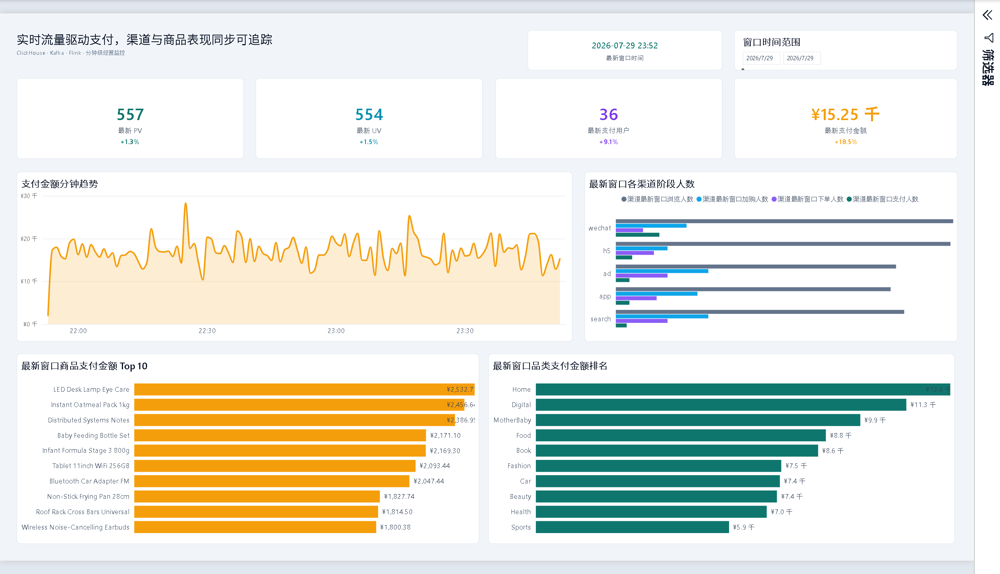
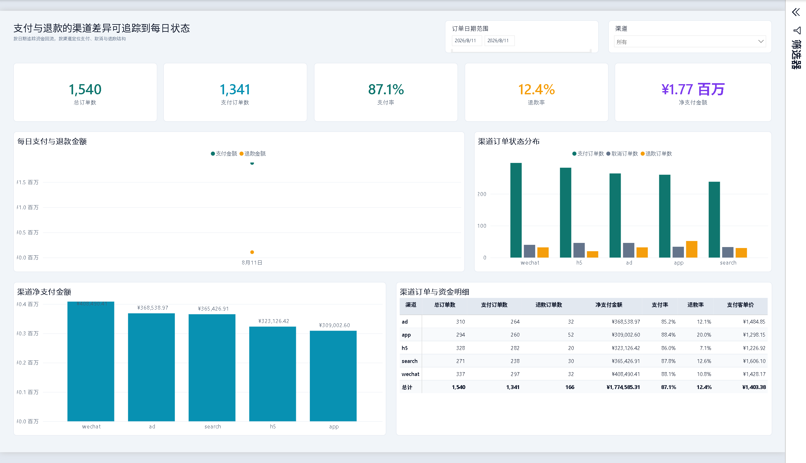

# 实时数仓运行目录

完整项目说明见仓库根目录 [README](../README.md)。

## 本目录包含

- `docker-compose.yml`：12 个长期运行容器和 1 个初始化服务（含可重启 ClickHouse Loader 与 Freshness Exporter）
- `flink-sql/`：行为流与 MySQL CDC 的 ODS、DWD、ADS SQL
- `contracts/`：五张 CDC 源表的字段、主键、Topic、删除语义和最终一致性契约
- `scripts/`：初始化、分阶段订单生成、常驻/批量装载、DELETE tombstone、Schema 演练、恢复、压测与验收
- `bi/`：Power BI 业务看板；`dashboard/`：Streamlit 开发诊断页
- `monitoring/`：Prometheus 与 Grafana 配置
- `docs/`：架构、数据模型、面试问答和质量报告

## 运行

```bash
docker compose up -d
bash scripts/run_demo.sh
python3 -m streamlit run dashboard/app.py
```

> `run_demo.sh` 会重建容器和数据卷，只应在本地 Demo 环境运行。

## Power BI 看板

入口是 `bi/电商实时数仓运营看板.pbip`，当前包含三个 1920×1080 页面：

- `实时经营总览`：分钟级 PV、UV、支付指标、渠道漏斗与商品/品类排行。
- `订单生命周期`：每日支付/退款趋势、渠道状态分布、净支付金额和渠道明细。
- `SCD2 版本审计`：商品版本数量、调价商品和版本生效区间明细。

刷新前先运行 `docker compose up -d` 并确认 ClickHouse 可通过 `localhost:8123` 访问；随后打开 PBIP，在 Power BI Desktop 中执行“刷新”。首次刷新需要按 [Power BI 使用说明](bi/PowerBI看板使用说明.md) 配置 ClickHouse ODBC 数据源凭据。

三页验收截图：






精选的可复核证据会随仓库保留：

- `artifacts/benchmark_20260811_153602.md`：单机吞吐实测及口径边界
- `artifacts/fault_recovery_20260811_153947.md`：TaskManager 故障恢复演练
- `artifacts/enterprise_quality_report.md`：24 项数据质量规则结果

## 核心口径

- PV 只统计 `view` 事件
- UV 统计发生 `view` 的去重用户
- 商品/品类表是窗口聚合，看板选择 Top 10
- 渠道表按 `session_id` 和事件时间计算 30 分钟严格路径漏斗
- DWS 是 Flink 逻辑聚合层，没有单独持久化
- Kafka 到 ClickHouse 使用手动提交与 ReplacingMergeTree 逻辑幂等，不宣称分布式事务 Exactly Once
- Loader 对 JSON、字段类型/格式和必填字段做逐条预校验，异常先写入纯 `compact` 的 `clickhouse_loader_dlq`，broker 确认后才提交源 offset；DLQ 的最新状态不按时间过期。`scripts/replay_loader_dlq.py` 默认只读，执行回放还必须完整扫描到所有分区当时的 high watermark，且指定单条消息、修复方式和 `--execute`
- 订单 CDC 按明细粒度关联支付、退款和事件时间 SCD2 商品版本
