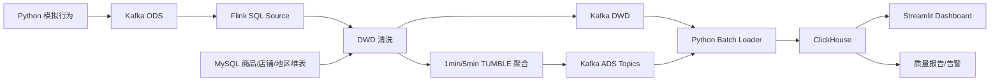

# 电商用户行为实时数仓架构说明

## 1. 设计目标

项目目标是用可在个人电脑运行的方式复现一条完整实时数据链路，并明确区分“已经实现的能力”和“生产环境仍需补充的能力”。

已实现：

- Kafka 接入和分层 Topic
- Flink SQL 事件时间、Watermark、清洗、维表关联和窗口聚合
- ClickHouse 明细与指标存储
- Python 批量装载、质量报告和告警
- Streamlit 运营展示

## 2. 数据流



## 3. 时间语义

ODS 中的 `event_time` 转换为 Flink `event_ts`。Source 定义：

```sql
WATERMARK FOR event_ts AS event_ts - INTERVAL '5' SECOND
```

含义是允许 5 秒内的有限乱序。有限批次生成器按事件时间递增发送，并默认注入 3 秒抖动。Watermark 推进到窗口结束时间后，TUMBLE 窗口输出结果；超过 Watermark 的更晚数据可能无法进入已关闭窗口。

## 4. 维表关联

MySQL 保存：

| 维表 | 主键 | 主要属性 |
| --- | --- | --- |
| `dim_product` | `product_id` | 商品名、品类、价格 |
| `dim_shop` | `shop_id` | 店铺名、地区 ID |
| `dim_region` | `region_id` | 省份、城市 |

Flink 使用 processing-time JDBC Temporal Join：

```sql
LEFT JOIN dim_product FOR SYSTEM_TIME AS OF o.proc_time AS p
ON o.product_id = p.product_id
```

本实现没有配置 Lookup Cache，也没有 CDC。它读取维表当前可见状态，不能还原事件发生时的历史维度版本。

## 5. 分层与持久化

| 层级 | 当前实现 |
| --- | --- |
| ODS | Kafka 原始行为 Topic |
| DWD | Flink 清洗与维度补充；Kafka 和 ClickHouse 持久化 |
| DWS | Flink SQL 窗口聚合逻辑，不单独落表 |
| ADS | Kafka 结果 Topic 和 ClickHouse 指标表 |

因此面试中应表述为“按 ODS-DWD-ADS 组织持久化层，DWS 是逻辑聚合层”，不要声称已经完整落地四层物理数仓。

## 6. 指标口径

| 指标 | 口径 |
| --- | --- |
| PV | 窗口内 `event_type='view'` 的事件数 |
| UV | 窗口内发生 `view` 行为的去重用户数 |
| 加购用户 | `cart` 的去重用户数 |
| 下单用户 | `order` 的去重用户数 |
| 支付用户 | `pay` 的去重用户数 |
| 支付金额 | `pay` 事件的金额之和 |
| 商品支付聚合 | 5 分钟内按商品统计支付次数与金额 |
| 品类支付聚合 | 5 分钟内按品类统计支付次数、用户与金额 |
| 渠道阶段人数 | 1 分钟内按渠道统计四类行为的去重用户数 |

商品和品类 SQL 产出的是窗口内每个维度成员的聚合结果，不是 Flink TopN；Top 10 由 Streamlit 从最新窗口中选择。

渠道结果不具备严格漏斗的必要条件：模拟事件没有订单/会话标识，也不保证同一用户依次完成所有阶段。因此只用于阶段人数和比率比较。

## 7. ClickHouse 写入

Flink 先将 DWD/ADS 输出到 Kafka，Python Loader 再按目标表缓存消息并批量发送 `JSONEachRow` HTTP 请求。批次写入成功后同步提交 Kafka offset。

这比逐行 HTTP 请求减少了请求次数，并避免自动提交导致“offset 已提交、数据尚未落库”的明显风险。但它仍不是端到端 Exactly Once：在写入成功、offset 提交失败的窗口内，重启可能重复写入。

## 8. ClickHouse 表引擎

- DWD 和告警使用 `MergeTree`
- ADS 使用 `ReplacingMergeTree`

`ReplacingMergeTree` 在后台合并时按排序键去除旧版本，不保证写入后立即只返回一行。Dashboard 对 ADS 查询使用 `FINAL`，以获得适合演示的稳定结果；大规模生产查询应使用版本列、聚合查询或其他建模方式控制成本。

## 9. 数据质量

质量报告仅验证 ClickHouse DWD/ADS，不估算 Kafka ODS 行数：

- 主键完整性与重复事件 ID
- 合法事件类型
- 商品、店铺、地区命中率
- ADS 核心表非空
- `UV <= PV`

## 10. 生产化差距

- Kafka 多分区、多副本与容量规划
- Flink Checkpoint、状态后端、重启策略和监控
- 端到端一致性语义
- MySQL CDC 与维度历史版本管理
- JDBC Lookup Cache 或异步维表访问
- 严格业务事件模型：`order_id`、`session_id`、事件序列和状态变更
- 元数据、血缘、口径中心和调度治理
- 密钥管理、权限隔离、审计与脱敏
