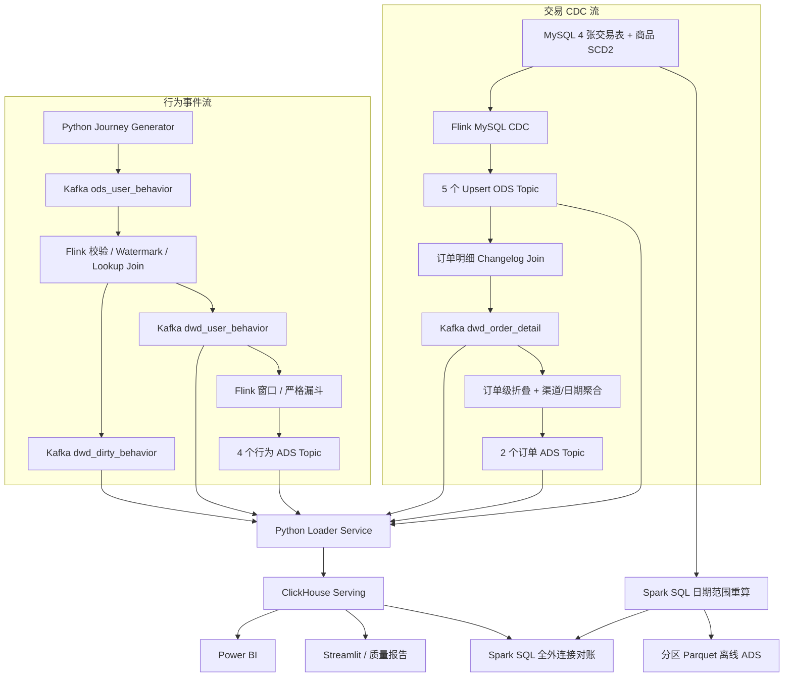

# 实时数仓架构与故障边界

## 1. 设计目标

在单机 Docker Desktop 中复现一条可验证的实时数仓链路，重点回答四个问题：数据怎样进入、更新怎样传播、失败怎样恢复、结果怎样证明正确。项目同时保留行为事件流和交易 CDC 流，用来展示 Append 与 Changelog 两类不同语义。

## 2. 总体数据流



## 3. 行为事件流

生成器为每次旅程提供稳定的 `session_id`、`order_id`、事件顺序和固定随机种子，并注入少量空主键、空用户和非法类型。Flink 将可解析但业务不合法的数据送入 DLQ，合法事件补充商品、店铺和地区属性后写 DWD。

事件时间定义：

```sql
WATERMARK FOR event_ts AS event_ts - INTERVAL '5' SECOND
```

这表示容忍有限乱序，不表示任何迟到数据都不会丢失。有限批次按事件时间递增发送，并只注入小于 Watermark 的抖动。

## 4. 交易 CDC 流

MySQL 启用 ROW binlog 和 7 天保留，专用 `flink_cdc` 用户仅拥有 CDC 所需权限。一个 Flink StatementSet 同时捕获：

- `order_info`
- `order_detail`
- `payment_info`
- `refund_info`
- `dim_product_scd2`

ODS 使用 Upsert Kafka，主键相同的新值代表更新，tombstone 代表删除。DWD 从五个 Changelog Source 关联出订单明细宽表，状态变化会更新既有业务键，而不是追加一条互相矛盾的“最新状态”。五个 MySQL CDC Source 虽在同一 Flink 作业和 Checkpoint 节奏中运行，但各自维护快照/位点并输出到不同 Topic，不提供跨 Topic 原子可见性；订单、支付、退款的关联结果依靠 Changelog 持续更新后最终收敛。

订单生成器先提交全部 `CREATED` 事实，再以独立事务提交支付/取消，最后单独提交退款，使 CDC 能真实观察 `CREATED → PAID/CANCELLED → REFUNDED`，而不是在同一批事务中直接看到终态。

商品维度关联条件：

```sql
detail.product_id = dim.product_id
AND order.create_time >= dim.effective_from
AND order.create_time < dim.effective_to
```

因此调价后仍可回答“下单当时的商品目录价是多少”。

## 5. Flink 作业拆分

当前共 9 条作业：

| 组 | 作业数 | 目的 |
| --- | ---: | --- |
| 行为 DLQ / DWD / ADS | 6 | 将故障和资源开销隔离，便于观察每类指标 |
| MySQL CDC StatementSet | 1 | 统一编排五个独立 Source；共享 Checkpoint 节奏但不宣称跨表原子提交 |
| 订单 DWD | 1 | 维护多表 Changelog Join 状态 |
| 订单 ADS StatementSet | 1 | 从同一订单级结果输出渠道与日期两个口径 |

TaskManager 配置 16 个 Slot 以容纳本地演示。生产环境应按算子链、吞吐和状态大小设置并行度，不应照抄本地 Slot 数。

订单 DWD Join 与 ADS 聚合的状态 TTL 为 30 天，用来覆盖本项目退款观察窗口。生产值必须与业务允许的最晚退款时间对齐，并结合状态大小、Checkpoint 时长和存储容量评估；超过 TTL 才到达的极晚更新不能保证仍可与已清理状态关联。

## 6. Checkpoint 与恢复

- 10 秒 Checkpoint。
- Embedded RocksDB 状态后端。
- Checkpoint 和 Savepoint 目录挂载到持久化卷。
- 固定延迟重启，每 5 秒重试，最多 100 次。
- Kafka Sink 使用事务性 Exactly-Once。

故障脚本先记录已有恢复日志数量，杀掉 TaskManager，再要求出现新的 `Restoring job ... from Checkpoint` 证据，最后等待 9 条作业及全部 Task 恢复 RUNNING。这样不会把旧日志或瞬时 RUNNING 状态误判为本次恢复成功。

## 7. ClickHouse 装载语义

Compose 默认运行可重启的 `clickhouse-loader` 常驻服务；同一脚本仍可通过非零 `--idle-timeout` 和独立消费组执行有限批处理或故障回放。Loader 的顺序是：消费 → 分表缓冲 → 批量写入成功 → 同步提交 Kafka offset。若“写入成功但 offset 提交失败”，消息会重放；表通过稳定业务键、确定性的 `version_epoch + Kafka partition/offset` `ingest_version` 和 `ReplacingMergeTree` 接受重复物理写入，验收使用 `FINAL` 获取逻辑最新值。业务键必须保持 Kafka 分区稳定；若保留 ClickHouse 卷却重置 Kafka offset 或重分区，必须先递增 `CLICKHOUSE_LOADER_VERSION_EPOCH` 并完成迁移评审。

订单相关 Upsert Topic 的 tombstone 会转成 `is_deleted=1` 的软删除版本，防止下游无法表达撤回。

`scripts/delete_tombstone_drill.py` 会先固定 `ods_order_info` 各分区的当前 end offset，再删除一张已落 DWD 的订单头，依次验证目标键的 ODS `value=null` tombstone、全部关联明细在 ClickHouse `FINAL` 中变为软删除；随后恢复源订单，并反向验证 ODS upsert 与 DWD 明细重新生效，用可回滚方式验证整条删除链路。

这提供的是最终一致和业务键逻辑幂等，不是 Kafka 与 ClickHouse 的两阶段提交。

## 8. Schema Evolution

CDC Source 采用显式字段。`contracts/cdc_contracts.json` 以机器可读方式登记五张源表的字段类型、可空性、主键、ODS Topic、tombstone 删除语义和 `cross_table_consistency=eventual`；CI 会把它与 MySQL DDL、Flink Source/Sink DDL 逐字段比对。上游新增可空字段时，旧作业继续读取已有列，变更登记在 `cdc_schema_contract`；下游采用先加后用并通过 Savepoint 升级。删除、改名和类型收窄视为不兼容变更，不能自动传播。

演练脚本可重复执行：字段不存在则添加，已存在则跳过 DDL，并验证 9 条作业持续健康。

## 9. 可观测性

- Flink 暴露 JobManager/TaskManager 指标。
- Kafka Exporter 暴露 Topic、消费组和 Lag。
- ClickHouse Loader 在 `:9410/metrics` 暴露消费消息、成功写入行、插入失败、成功批次、最后成功时间和批次耗时。
- Prometheus 拉取并执行告警规则。
- Grafana 展示组件存活、Records、Checkpoint 与 Lag。
- Alertmanager 接收、分组和路由告警。

Loader 不可抓取超过 1 分钟触发 `LoaderDown`；默认 `clickhouse_loader` 消费组仍有 Lag 且超过 5 分钟没有成功写入时触发 `LoaderWriteStalled`，避免在正常无数据空闲期误报。

本地 Alertmanager 未配置真实外部接收人；生产需要接入邮件、IM 或值班平台，并设置抑制、静默和升级策略。

## 10. 明确边界

- 单 Broker、单副本、单 JobManager、单 TaskManager，只能验证机制，不能证明高可用。
- 本地卷不是跨节点容灾存储。
- 行为 JDBC Lookup 读取处理时刻当前维度；交易 SCD2 才提供历史版本语义。
- Python Loader 是教学和可解释实现，大吞吐生产应评估成熟 Connector。
- DWS 没有单独物理表，不能宣称完整四层物理数仓。
- Spark 使用 `local[2]` 按需容器和本地 Parquet，只验证历史回补、幂等分区覆盖与批流对账语义，不宣称分布式离线湖仓。
