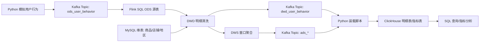

# 电商用户行为实时数仓架构说明

## 1. 架构目标

本项目的目标是构建一条完整的实时数据处理链路。它不是只演示单个组件，而是把实时日志采集、实时计算、维表关联、指标落库和结果查询串起来，形成一个具备数仓分层思想的项目案例。

项目重点体现：

- 实时日志如何进入 Kafka。
- Flink SQL 如何持续消费 Kafka 数据。
- 行为日志如何关联 MySQL 维表。
- 实时数仓如何按照 ODS、DWD、DWS、ADS 分层。
- 统计结果如何写入 ClickHouse 并进行查询。

## 2. 总体架构



## 3. 数据流说明

### 3.1 数据产生

`scripts/generate_mock_events.py` 会持续生成用户行为事件。每条事件代表用户在某个时间点做了一次操作，例如浏览商品、加入购物车、下单或支付。

事件字段示例：

```json
{
  "event_id": "6b6f2e6b-8d9b-4a6a-98a8-f2f6a3f6b001",
  "user_id": 10086,
  "product_id": 1001,
  "shop_id": 1,
  "event_type": "pay",
  "channel": "app",
  "amount": 199.00,
  "event_time": "2026-06-29 20:30:00"
}
```

### 3.2 数据接入

Kafka Topic `ods_user_behavior` 接收原始 JSON 日志。Kafka 在项目中承担缓冲和解耦作用：

- Python 只负责写入 Kafka。
- Flink 只负责从 Kafka 消费。
- 两者互不直接依赖。

### 3.3 实时清洗

Flink SQL 将 Kafka 中的 JSON 解析成表结构，生成 ODS 源表。随后在 DWD 层完成：

- 过滤空事件 ID。
- 过滤空用户 ID。
- 限定合法行为类型。
- 转换事件时间字段。
- 关联商品和店铺维表。

### 3.4 维表关联

用户行为日志只保存 `product_id`、`shop_id`。这些 ID 本身不方便分析，因此需要从 MySQL 维表中补充业务字段。

维表包括：

| 表 | 内容 |
| --- | --- |
| `dim_product` | 商品名称、品类、价格 |
| `dim_shop` | 店铺名称、所属地区 |
| `dim_region` | 省份、城市 |

### 3.5 指标计算

Flink SQL 在 DWS/ADS 阶段计算实时指标：

- 1 分钟窗口 PV、UV。
- 1 分钟窗口加购人数、下单人数、支付人数。
- 1 分钟窗口支付金额。
- 5 分钟窗口商品支付排行。

### 3.6 结果落库

Flink 结果会先进入 Kafka 结果 Topic，再由 `scripts/load_kafka_to_clickhouse.py` 写入 ClickHouse。ClickHouse 保存两类结果：

- DWD 明细：用于追溯每条清洗后的行为记录。
- ADS 指标：用于快速查询实时统计结果。

## 4. 数仓分层设计

| 层级 | 作用 | 本项目对应内容 |
| --- | --- | --- |
| ODS | 接收原始数据，尽量不改变原始结构 | Kafka Topic `ods_user_behavior` |
| DWD | 清洗明细数据，补充业务维度 | Kafka Topic `dwd_user_behavior`、ClickHouse 表 `dwd_user_behavior` |
| DWS | 面向主题进行汇总统计 | Flink SQL 窗口聚合 |
| ADS | 面向查询和分析输出结果 | `ads_realtime_overview`、`ads_product_rank` |

### 4.1 ODS 层

ODS 层保留原始日志，主要字段包括事件 ID、用户 ID、商品 ID、店铺 ID、行为类型、访问渠道、金额和事件时间。

### 4.2 DWD 层

DWD 层解决两个问题：

1. 数据是否干净。
2. 字段是否完整。

原始日志中的 `product_id` 和 `shop_id` 会被补充为商品名称、品类名称、店铺名称等字段。

### 4.3 DWS 层

DWS 层按照业务主题做聚合，例如：

- 按时间窗口统计访问和交易。
- 按商品统计支付次数和支付金额。
- 按渠道统计转化情况。

### 4.4 ADS 层

ADS 层是最终查询层。它不再关注原始明细处理过程，而是直接提供可以被报表、接口或看板使用的数据。

## 5. 表设计

### 5.1 MySQL 维表

`dim_product`

| 字段 | 说明 |
| --- | --- |
| `product_id` | 商品 ID |
| `product_name` | 商品名称 |
| `category_id` | 品类 ID |
| `category_name` | 品类名称 |
| `price` | 商品价格 |

`dim_shop`

| 字段 | 说明 |
| --- | --- |
| `shop_id` | 店铺 ID |
| `shop_name` | 店铺名称 |
| `region_id` | 地区 ID |

`dim_region`

| 字段 | 说明 |
| --- | --- |
| `region_id` | 地区 ID |
| `province` | 省份 |
| `city` | 城市 |

### 5.2 ClickHouse 明细表

`dwd_user_behavior` 保存清洗和补维后的用户行为明细。

常用字段：

| 字段 | 说明 |
| --- | --- |
| `event_id` | 事件 ID |
| `user_id` | 用户 ID |
| `product_name` | 商品名称 |
| `category_name` | 品类名称 |
| `shop_name` | 店铺名称 |
| `event_type` | 行为类型 |
| `channel` | 渠道 |
| `amount` | 金额 |
| `event_ts` | 事件时间 |

### 5.3 ClickHouse 指标表

`ads_realtime_overview`

| 字段 | 说明 |
| --- | --- |
| `window_start` | 窗口开始时间 |
| `window_end` | 窗口结束时间 |
| `pv` | 页面访问次数 |
| `uv` | 去重访问用户数 |
| `cart_users` | 加购用户数 |
| `order_users` | 下单用户数 |
| `pay_users` | 支付用户数 |
| `pay_amount` | 支付金额 |

`ads_product_rank`

| 字段 | 说明 |
| --- | --- |
| `window_start` | 窗口开始时间 |
| `window_end` | 窗口结束时间 |
| `product_id` | 商品 ID |
| `product_name` | 商品名称 |
| `category_name` | 品类名称 |
| `pay_count` | 支付次数 |
| `pay_amount` | 支付金额 |

## 6. 核心指标口径

| 指标 | 统计口径 |
| --- | --- |
| PV | 窗口内全部行为记录数 |
| UV | 窗口内去重用户数 |
| 加购人数 | 窗口内 `event_type = 'cart'` 的去重用户数 |
| 下单人数 | 窗口内 `event_type = 'order'` 的去重用户数 |
| 支付人数 | 窗口内 `event_type = 'pay'` 的去重用户数 |
| 支付金额 | 窗口内支付事件的金额总和 |
| 商品排行 | 按商品统计支付次数和支付金额 |

## 7. 可扩展设计

项目可以继续扩展为更完整的实时数仓：

- 增加用户维表，统计新老客、性别、年龄段等指标。
- 增加地区维表关联，统计省市维度成交情况。
- 接入 CDC 工具，让 MySQL 维表变化实时同步。
- 使用 Redis 缓存维表，提高高并发维表查询性能。
- 将 ClickHouse 替换或扩展为 Doris、Paimon、Hudi 等实时湖仓组件。
- 接入 DataEase、Superset、Grafana 等可视化工具。
