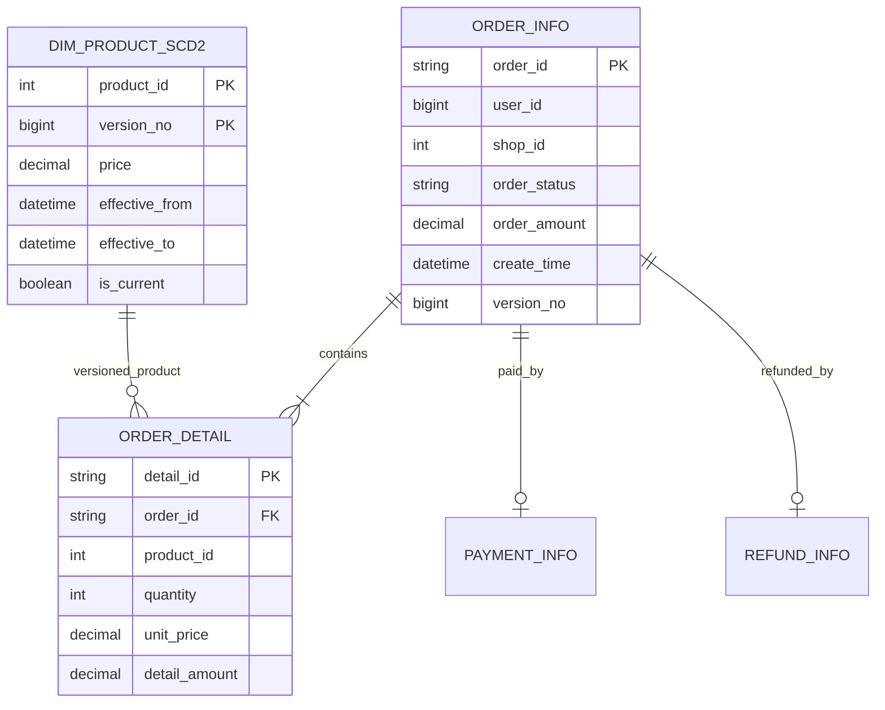

# 数据模型、粒度与指标口径

## 1. 业务过程

项目建模两个过程：

1. 用户在一次会话中的浏览、加购、下单、支付行为。
2. 一笔交易从创建到支付、取消或退款的生命周期。

行为链路适合事件时间窗口与漏斗；交易链路适合 CDC 更新流、订单事实和历史维度。

## 2. 核心事实粒度

### `dwd_user_behavior`

一行代表一个用户在一个时间点对一个商品发生的一次行为，业务键是 `event_id`。

### `dwd_order_detail`

一行代表一张订单中的一条商品明细，业务键是 `detail_id`。它携带订单当前状态、支付/退款结果和下单时商品历史版本。

选择明细粒度的原因：一张订单可含多个商品，订单金额不能直接重复到每行后再求和。下游先按 `order_id` 折叠订单级指标，再做渠道或日期聚合，避免多明细订单被重复计数。

## 3. MySQL 交易模型

订单状态允许：`CREATED`、`PAID`、`CANCELLED`、`REFUNDED`。支付成功订单必须存在 `payment_status='SUCCESS'`；退款订单必须存在成功退款记录和正退款金额。

## 4. SCD2 规则

商品调价过程在一个事务内：

1. 当前版本的 `effective_to` 设置为调价时间，`is_current=0`。
2. 插入版本号加一的新记录，`effective_from=调价时间`、`effective_to=2299-12-31`、`is_current=1`。
3. 同步更新当前商品表，供行为 Lookup 使用。

有效区间采用左闭右开 `[from, to)`，保证边界时刻只命中一个版本。验收要求每个商品恰好一个当前版本，任意两个版本区间不重叠。

## 5. ODS/DWD/ADS 表

| 层 | 数据集 | 粒度 |
| --- | --- | --- |
| ODS | `ods_user_behavior` | 一条原始行为 JSON |
| ODS | `ods_order_info/detail/payment/refund` | 一个业务主键的最新 Changelog 值 |
| ODS | `ods_dim_product_scd2` | 商品 + 版本的一条历史记录 |
| DWD | `dwd_user_behavior` | 一次合法行为 |
| DWD | `dwd_order_detail` | 一条订单明细最新宽表状态 |
| ADS | `ads_realtime_overview` | 1 分钟窗口一行 |
| ADS | `ads_product_rank` | 5 分钟窗口 + 商品一行 |
| ADS | `ads_category_rank` | 5 分钟窗口 + 品类一行 |
| ADS | `ads_channel_funnel` | 30 分钟窗口 + 渠道一行 |
| ADS | `ads_order_lifecycle` | 渠道一行最新生命周期指标 |
| ADS | `ads_order_daily` | 日期 + 渠道一行 |
| 离线 ADS | Parquet `ads_order_daily/order_date=...` | 日期 + 渠道一行；Spark 回补结果 |
| 对账 | Parquet `reconciliation/order_daily` | 日期 + 渠道一行；离线/实时逐指标比较 |

## 6. 行为指标

| 指标 | 定义 | 注意 |
| --- | --- | --- |
| PV | 窗口内 `event_type='view'` 的事件数 | 不能用全部事件 `COUNT(*)` |
| UV | 窗口内发生 view 的去重用户数 | 跨窗口不可直接相加 |
| 支付金额 | pay 事件 amount 之和 | 仅行为模拟口径 |
| 严格漏斗 | 同一 session 依次满足 view ≤ cart ≤ order ≤ pay | 受 30 分钟固定窗口边界影响 |

商品/品类表保存窗口聚合，不是 Flink TopN；Top 10 由展示层在最新窗口选择。

## 7. 订单指标

先按 `order_id` 将多明细折叠成一行，再聚合：

- `total_orders`：订单数。
- `paid_orders`：当前状态为 PAID 或 REFUNDED 的订单数。
- `cancelled_orders`：当前状态为 CANCELLED 的订单数。
- `refunded_orders`：当前状态为 REFUNDED 的订单数。
- `paid_amount`：成功支付金额；每张订单只统计一次。
- `refund_amount`：成功退款金额；每张订单只统计一次。

一致性约束：`refunded_orders <= paid_orders <= total_orders`、`cancelled_orders <= total_orders`、`0 <= refund_amount <= paid_amount`。

Spark SQL 复用同一订单级口径，但从 MySQL 事务事实独立重算。回补参数使用 `[start_date,end_date)`，输出按 `order_date` 动态覆盖；与 ClickHouse `ads_order_daily FINAL` 通过日期、渠道全外连接，任意一侧缺行或七项指标不一致均判定失败。

## 8. 删除与版本

Kafka Upsert tombstone 在 ClickHouse 转换为相同业务键的 `is_deleted=1` 高版本记录。查询使用 `FINAL WHERE is_deleted=0` 获取当前逻辑状态。`FINAL` 适合当前实验验收；生产大表应评估物化视图、聚合模型或查询侧版本函数，避免无条件依赖昂贵的 FINAL。

## 9. 质量规则

质量报告覆盖：

- 行为/订单业务键非空且唯一。
- 事件类型和订单状态合法。
- 商品、店铺、地区命中率。
- 支付与退款记录一致。
- 订单成交价等于下单时命中的 SCD2 目录价。
- 每个商品唯一当前版本，版本区间不重叠。
- 行为漏斗与订单 ADS 指标不违反单调关系。
- 重放后逻辑业务键不膨胀。
