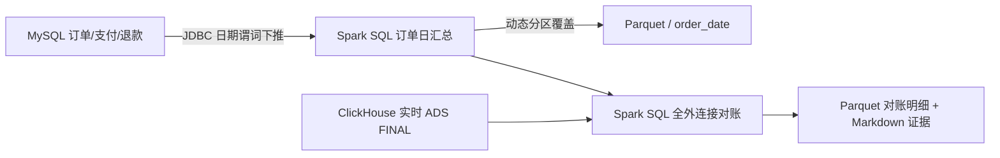

# Spark SQL 离线回补与实时对账

## 目标

Flink 负责持续增量计算，Spark SQL 负责指定历史日期范围的批量重算。该模块解决两个实时链路无法单独证明的问题：

1. 指标口径修改或历史数据修复后，能够重算指定日期分区，而不是全量重跑实时作业。
2. 以 MySQL 事务事实为独立来源，与 ClickHouse 实时 `ads_order_daily` 对账，发现漏算、重复或口径漂移。

## 数据流



## 为什么这样设计

- **独立事实来源：** 离线侧从 MySQL 事务表重算，不读取实时 DWD 后再“自己证明自己”。
- **最小权限与谓词下推：** 专用 `spark_batch` 账号仅可读订单、支付和退款三张表；三类查询都在 MySQL 侧按订单创建时间过滤，避免把全表拉进 Spark。
- **订单粒度先折叠：** 一张订单只统计一次支付和退款金额，保持与 Flink ADS 相同的业务口径。
- **左闭右开日期：** 参数 `[start_date, end_date)` 避免相邻批次在午夜边界重复。
- **动态分区覆盖：** 同一日期范围重复运行会覆盖对应 `order_date` Parquet 分区，不会追加重复数据。
- **全外连接对账：** 日期或渠道仅存在于一侧也会成为 mismatch，不会被 INNER JOIN 静默隐藏。

## 运行

先启动 MySQL 与 ClickHouse，并确保 `flink-lib/mysql-connector-j-8.3.0.jar` 已由连接器下载脚本准备好。

```powershell
.\scripts\run_spark_backfill.ps1 -StartDate 2026-08-11 -EndDate 2026-08-12
```

```bash
bash scripts/run_spark_backfill.sh 2026-08-11 2026-08-12
```

输出：

- `data/spark-warehouse/ads_order_daily/order_date=...`：离线 Parquet 分区，本地运行数据不提交 Git。
- `data/spark-warehouse/reconciliation/order_daily/...`：逐指标对账明细。
- `artifacts/spark_reconciliation_report.md`：可提交的精简验收证据。

默认存在任意 mismatch 即返回非零退出码。只有排查期间才使用 `-AllowMismatch` / `--allow-mismatch` 保留差异结果，不能把它当成正常生产参数。

## 当前实测

对 `[2026-08-11, 2026-08-12)` 运行两次：两次均从 1,540 笔订单重算出 5 行日期×渠道指标，与实时 ADS 的 5 行逐项一致，mismatch 为 0；第二次运行后 Parquet 仍为 5 行，验证重复回补不会膨胀。

## 边界

- 当前用 Spark `local[2]` 和本地 Parquet 展示批处理语义，不宣称分布式 Spark 集群或数据湖。
- Parquet 文件系统覆盖不是跨系统事务；生产可替换为支持快照提交的 Iceberg、Hudi 或 Delta Lake。
- 当前由脚本按需触发；当离线任务形成依赖、重试、补数审批和 SLA 后，再引入 Airflow 等调度平台。
